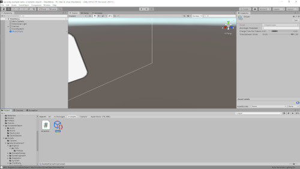
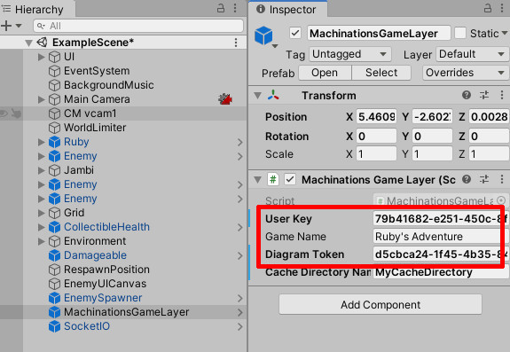
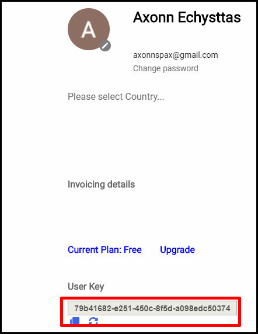
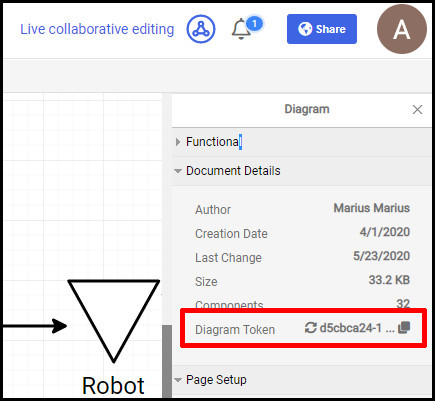

# Machinations UP - Unity Example: Tanks

This repository integrates Machinations UP within Tanks, an example used in a [popular talk](https://www.youtube.com/watch?v=6vmRwLYWNRo) on Unity Scriptable Objects.

# Running this example

1. Install the latest version of the Unity 3D Engine by downloading Unity Hub from [here](https://store.unity.com/#plans-individual). Once you installed Unity Hub, you will need to add a Unity 3D install. Stuck? Check our [Detailed Unity Installation Guide](README-unity.md) here.
2. Open Unity 3D and navigate to where you cloned this repo. Upon opening the folder, your Unity Editor should look something like this:  
   
3. In Machinations, create your own copy of our Tanks Unity Updated [Machinations diagram](https://my.machinations.io/public/-Tanks-Unity-updated/0d662f3049c168b328e2b78b18490e527) by clicking "Add to My Machinations" (top right).
4. In Unity, in the Scene Hierarchy tab, configure the `MachinationsGameLayer` with the correct `User Key` & `Diagram Token`. Here's how to find these:
   1. MachinationsGameLayer inside Unity:  
      
   2. User Key in your Machinations account:  
      
   3. Diagram Token in the Machinations Diagram:  
      
5. Run the game in Unity by pressing the "Play" arrow in the center-top, above the stage. Then, hit "Play" in the game's menu.
6. Go ahead and change the `Player Tank HP` Pool (or even better, the `Projectile Force` and `Projectile Radius` Pools) in the Tanks diagram. If everything works, you should see changes in the `TankStats` and/or `ShellStats` ScriptableObjects (which you can search for in Unity's Project tab).

# Points of Interest (within the example's code)

Classes inside the game use **UP** to get their values from the Machinations diagram, via the `MachinationsGameLayer`. Here are some files where you can see how it all works.

- Both `TankHealth.cs` and `TankMovement.cs` use the Scriptable Object `TankStats.cs`. This is a "Machinations ScriptableObject", as in, it serves as a direct connection between Machinations and Unity and does nothing else.
- `ShellExplosion.cs` uses `ShellStats.cs` to determine the Damage, Radius and Force of the explosion. This is another "Machinations ScriptableObject".
- `SimpleAudioEvent.cs` and `SimpleSniper.cs` are ScriptableObjects that also have their own functionality, beside the Machinations interface.

# Useful Links

Head over to our [Developer Portal](https://developer.machinations.io) for more Machinations tinkering adventures.

Machinations product documentation can be found [here](https://docs.machinations.io).

If you want to learn some Unity, why not see, step by step, how this very game was built: [Unity's Ruby's Adventure Tutorial](https://learn.unity.com/project/ruby-s-2d-rpg).
